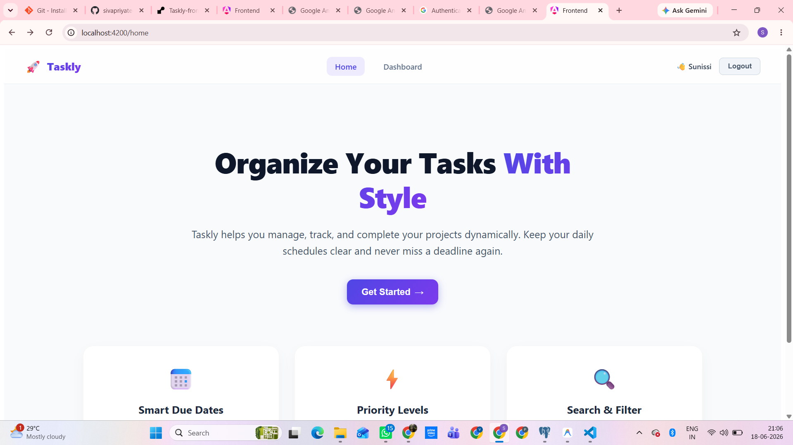
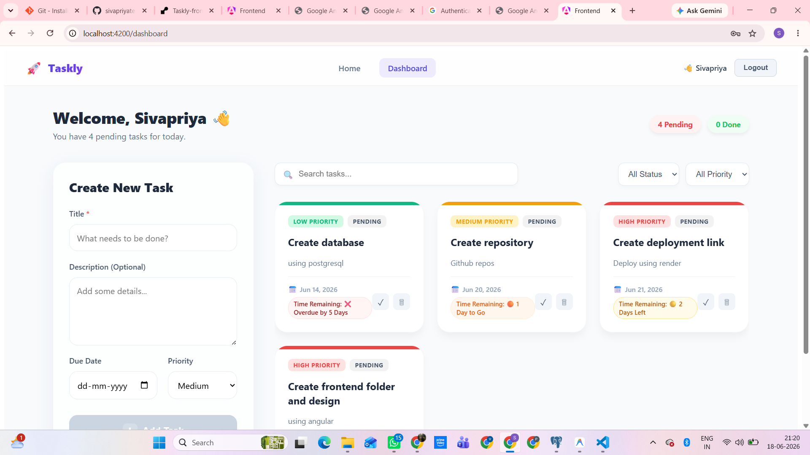
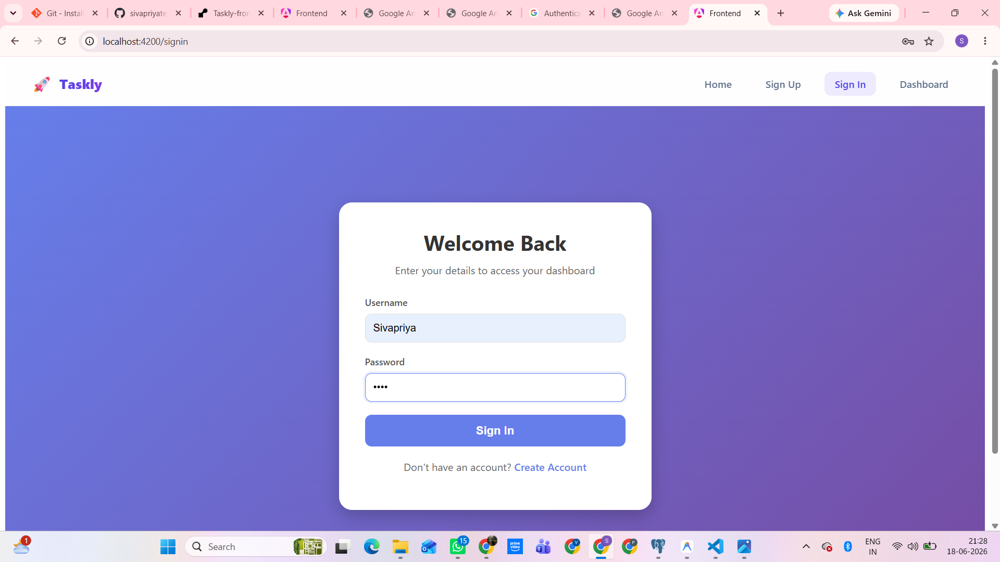
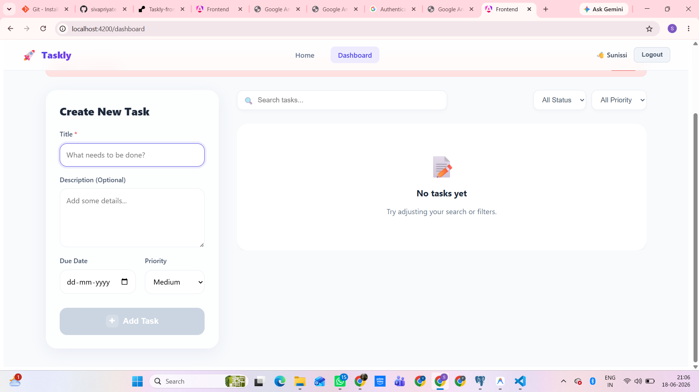
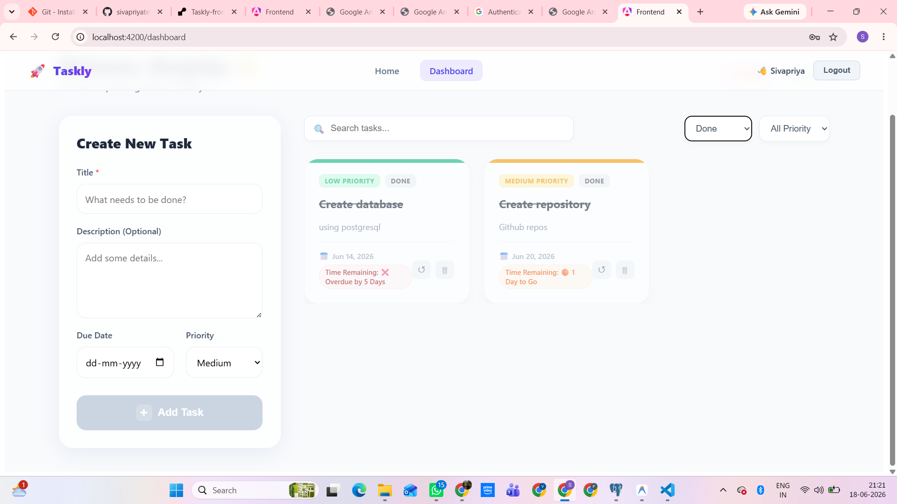
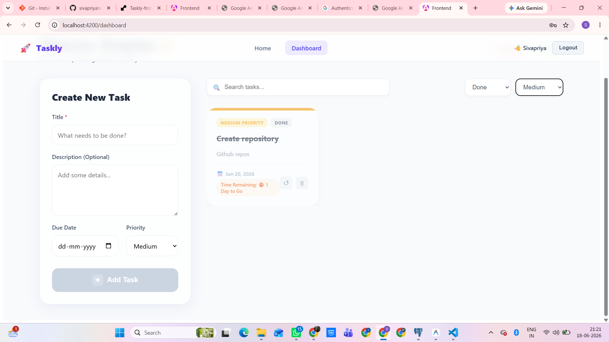
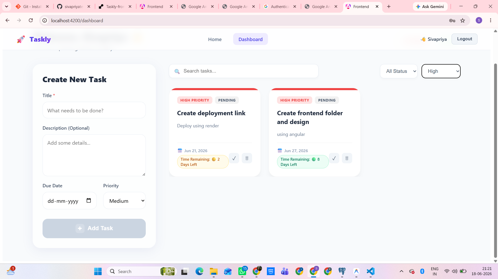
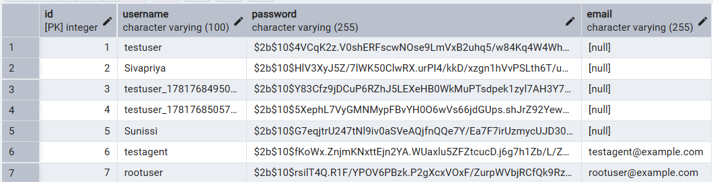
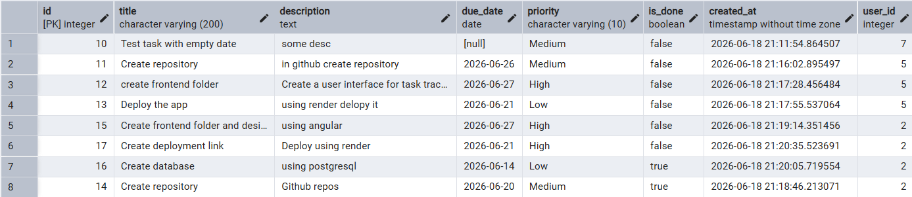

# 🚀 Taskly - Smart Task Management System

A modern full-stack task management web application that helps users organize and track their daily tasks efficiently. Taskly provides secure authentication and personalized dashboards, allowing each user to manage their own tasks independently.

---

# 🛠️ Tech Stack

## Frontend
- Angular 22
- TypeScript
- HTML5
- CSS3

## Backend
- Node.js
- Express.js

## Database
- PostgreSQL

## Authentication
- JWT (JSON Web Token)
- bcryptjs

## Deployment
- Render

---

# 📖 Project Description

Taskly is a full-stack task management application that helps users organize and track their daily activities. Users can register, securely log in, and manage their own tasks through a personalized dashboard.

Each user has separate tasks, ensuring privacy and secure task management.

---

# ✨ Features

- User Registration and Login
- JWT Authentication
- Password Encryption using bcryptjs
- Create Tasks
- Update Tasks
- Delete Tasks
- Mark Tasks as Completed
- User-specific Task Management
- Responsive UI
- Secure Backend APIs

---

# 🏠 Home Page

The Home Page acts as the entry point of the application and provides navigation to Sign Up and Sign In pages.

### Screenshot



---

# 📝 Sign Up Page

The Sign Up page allows new users to register.

### Features

- User Registration
- Email Validation
- Secure Account Creation
- Password Encryption

### Screenshot



---

# 🔐 Sign In Page

The Sign In page allows registered users to log in securely.

### Features

- Secure Login
- JWT Authentication
- Protected Access

### Screenshot



---

# 📊 Dashboard

The Dashboard is the core page of the application where users manage their tasks.

### Dashboard Overview



---

## ➕ Task Creation

Users can create tasks by providing:

- Task Title
- Description
- Due Date
- Priority

### Screenshot



---

## ✅ Task Management

Users can:

- View Tasks
- Edit Tasks
- Delete Tasks
- Mark Tasks as Completed

### Screenshot



---

## 📌 Task Organization

Tasks are organized efficiently for better productivity.

### Screenshot



---

# 🗄️ Database Design

PostgreSQL is used to store user and task information securely.

---

## User Table

Stores registered user details.

### Fields

- id
- username
- email
- password

### Screenshot



---

## Task Table

Stores task details for each user.

### Fields

- id
- title
- description
- due_date
- priority
- status
- user_id

### Screenshot



---

# 🔒 Security Features

- JWT Authentication
- Password Hashing using bcryptjs
- Protected Routes
- User-specific Data Isolation

---

# 🌐 Deployment
The frontend and backend were deployed separately using Render. However, due to some deployment and configuration issues, the live application could not be hosted successfully at this time.
## Frontend

[https://taskly-frontend-link.onrender.com](https://taskly-frontend-nydz.onrender.com)

## Backend

[https://taskly-backend-link.onrender.com](https://taskly-backend-q6a4.onrender.com)

---

# 📂 Project Structure

```text
Taskly
│
├── frontend
│
├── backend
│
├── homepage.png
├── signin.png
├── dashboard.png
├── d1.png
├── d2.png
├── d3.png
├── d4.png
├── user.png
├── task.png
│
└── README.md
```

---

# ✨ Conclusion

Taskly is a secure and efficient task management application developed to help users organize their daily activities. The system provides authentication, personalized dashboards, and task management capabilities, making it a practical solution for improving productivity.

---

# 👨‍💻 Developed By

### Siva Priya N

Master of Computer Applications (MCA)

Madras Christian College, Chennai

---

⭐ If you found this project useful, please consider giving it a star.
